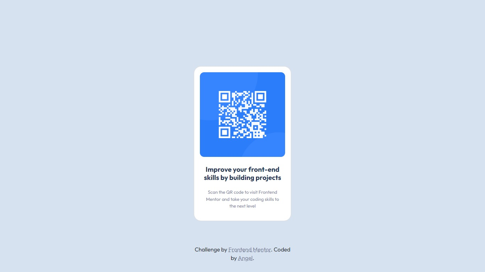
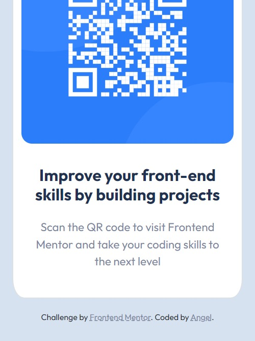

# Frontend Mentor - QR code component solution

This is an alternative solution to the [QR code component challenge on Frontend Mentor](https://www.frontendmentor.io/challenges/qr-code-component-iux_sIO_H). Frontend Mentor challenges help you improve your coding skills by building realistic projects. 

## Table of contents

- [Overview](#overview)
  - [Screenshot](#screenshot)
  - [Links](#links)
- [My process](#my-process)
  - [Built with](#built-with)
  - [What I learned](#what-i-learned)
  - [Continued development](#continued-development)
  - [Useful resources](#useful-resources)
- [Author](#author)

## Overview

### Screenshots

### Links

- Solution URL: [Here](https://github.com/akcumeh/07-qr-code-component)
- Live Site URL: [Here](https://akcumeh.github.com/07-qr-code-component)

## My process

### Built with

- Semantic HTML5
- CSS3
- 
- Mobile-first workflow

### What I learned

I got some practice using CSS flex.

### Continued development

- Code refactoring is really amazing! Clear cut workflow and code practices helps me cut down on unnecessary elements in my code and keeps it clean and simple.

### Useful resources

- Dr. Angela Yu's ["The Complete 2022 Web Development Bootcamp"](https://www.udemy.com/course/the-complete-web-development-bootcamp/) - Dr. Angela helped me understand the concept of code refactoring and it makes my work much cleaner and better.

## Author

You've been sweet enough to read up to this point! Then, just one more thing (or a few)...
- View and follow my GitHub - [Angel Umeh](https://github.com/akcumeh)
- Check out my Frontend Mentor profile - [@akcumeh](https://www.frontendmentor.io/profile/akcumeh)
- Follow me on Twitter - [@akcumeh](https://www.twitter.com/akcumeh)